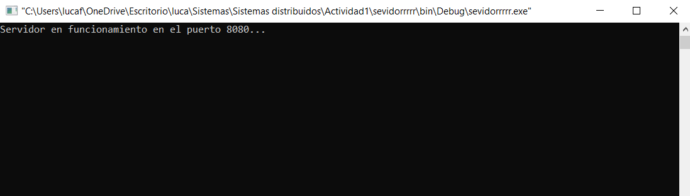
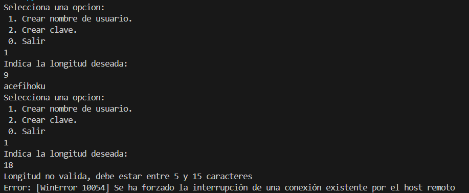

# ServidorClienteSockets

Este proyecto implementa un servidor en lenguaje C utilizando sockets, junto con dos clientes, uno en C y otro en Python, para generar nombres de usuario y contraseñas.

## Descripción

El servidor implementa las siguientes funcionalidades:
1. **Generador de nombres de usuario**: Indicando la longitud del nombre de usuario (debe validar que no sea menor a 5 ni mayor a 15), el servidor generará la cadena correspondiente alternando entre vocales y consonantes.
2. **Generador de contraseñas**: Indicando la longitud de la contraseña (debe validar que sea mayor o igual a 8 y menor a 50), el servidor generará una cadena alfanumérica, incluyendo mayúsculas y minúsculas.

## Imágenes

Captura de pantalla del servidor en ejecución:

Captura de pantalla del cliente en Python:

## Estructura del Proyecto

- **servidor.c**: Implementación del servidor en C.
- **cliente.c**: Implementación del cliente en C.
- **ClientePython.py**: Implementación del segundo cliente en Python.

## Compilación y Ejecución

### Servidor en C

Para compilar y ejecutar el servidor usando Code::Blocks, sigue estos pasos:

1. Abre Code::Blocks.
2. Crea un nuevo proyecto de consola en C.
3. Añade el archivo `servidor.c` al proyecto.
4. Compila y ejecuta el proyecto desde Code::Blocks.

### Cliente en C

Para compilar y ejecutar el cliente en C usando Code::Blocks, sigue estos pasos:

1. Abre Code::Blocks.
2. Crea un nuevo proyecto de consola en C.
3. Añade el archivo `cliente.c` al proyecto.
4. Compila y ejecuta el proyecto desde Code::Blocks.

### Cliente en Python

Para ejecutar el cliente en Python usando Visual Studio Code (VSCode), sigue estos pasos:

1. Asegúrate de tener Python instalado en tu sistema.
2. Abre Visual Studio Code.
3. Abre el directorio que contiene el archivo `ClientePython.py`.
4. Abre el archivo `ClientePython.py` en VSCode.
5. Abre una terminal integrada en VSCode (`Ctrl + `).
6. Ejecuta el cliente con el comando: `python ClientePython.py`.

## Pruebas Realizadas

Se han realizado las siguientes pruebas:
1. Verificación de la generación de nombres de usuario con longitudes válidas e inválidas.
2. Verificación de la generación de contraseñas con longitudes válidas e inválidas.
3. Comunicación correcta entre los clientes y el servidor.

## Estrategia de Resolución

El servidor en C fue diseñado para manejar múltiples clientes utilizando sockets. Los clientes se conectan al servidor y solicitan la generación de nombres de usuario o contraseñas. El servidor valida las longitudes solicitadas y responde con las cadenas generadas o mensajes de error en caso de validación fallida.

El cliente en C y el cliente en Python implementan menús que permiten al usuario elegir entre generar un nombre de usuario o una contraseña, y envían las solicitudes al servidor. Los resultados se muestran al usuario en la consola.

## Contacto

Para más información o preguntas, mi correo: [fattouzuki@gmail.com](mailto:fattouzuki@gmail.com).
